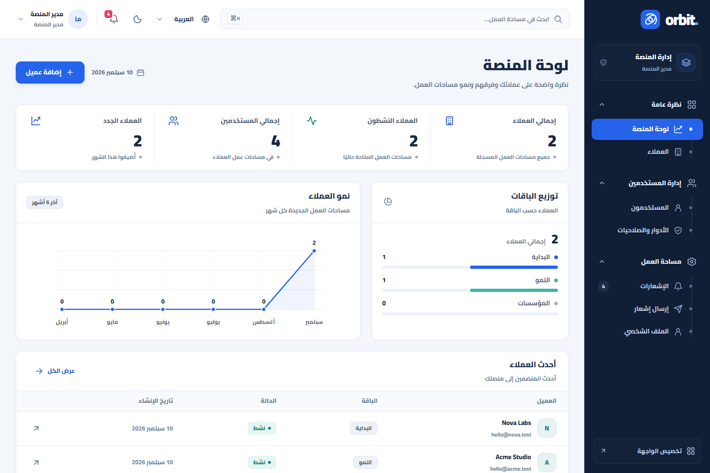
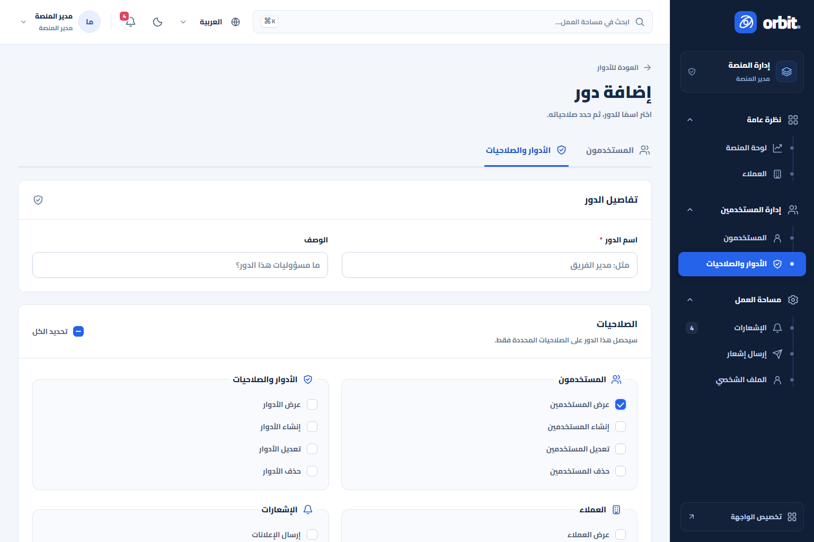
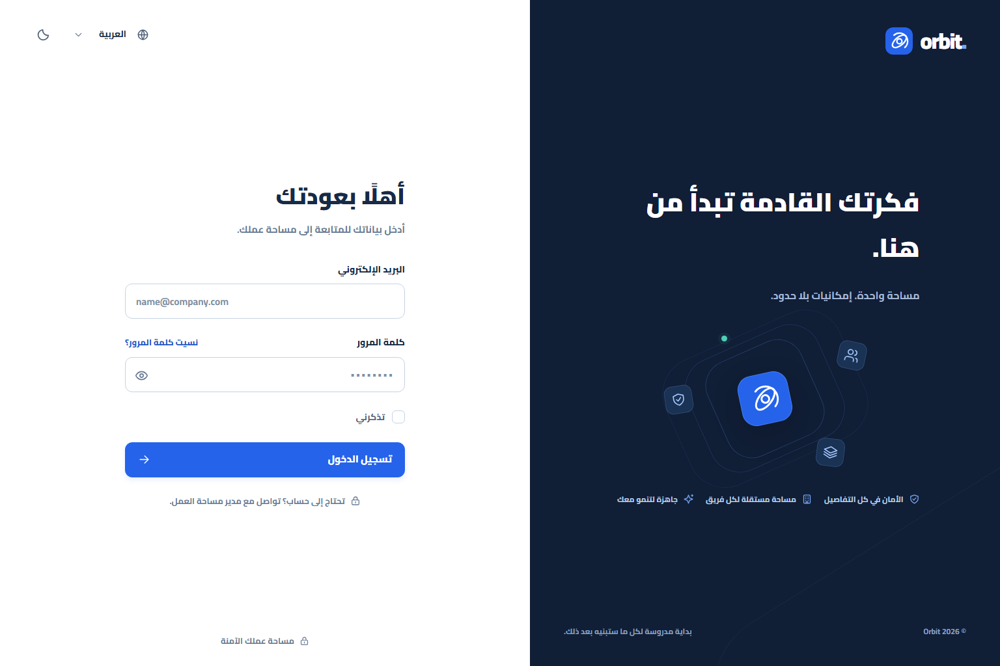
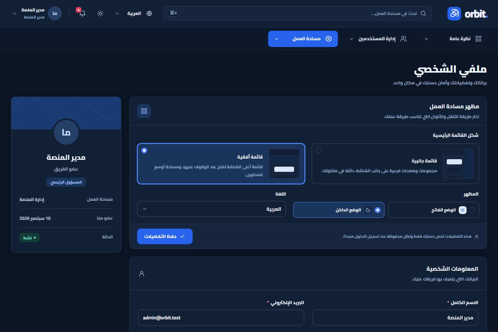
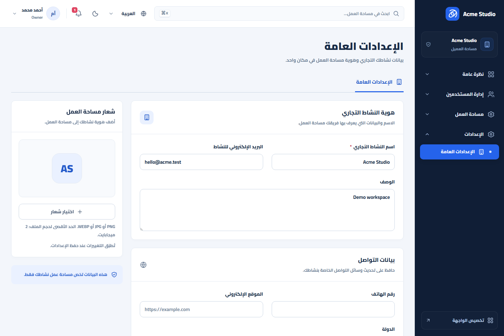
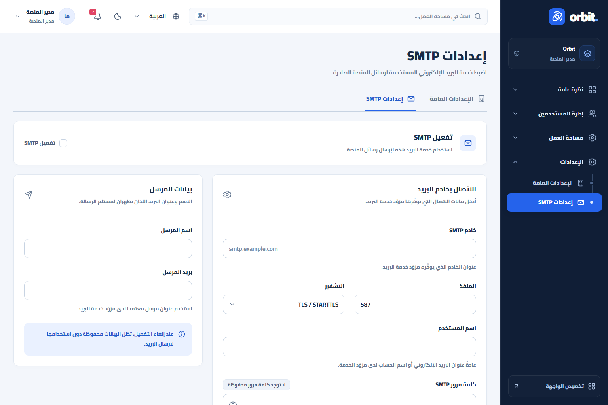
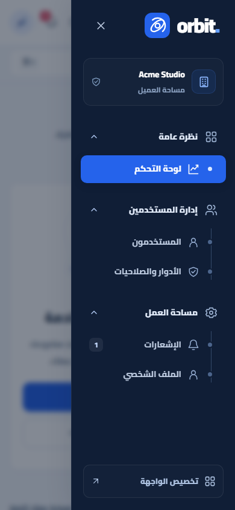

# Orbit SaaS Dashboard 🚀

Orbit is a reusable Laravel SaaS dashboard starter built for practical cPanel hosting. It gives you a polished Super Admin area, tenant/client dashboards, user management, role permissions, notifications, workspace settings, SMTP settings, multilingual UI, dark mode, and a clean Blade-based frontend without a JavaScript build pipeline.

The project is designed as a ready foundation for future SaaS products: install it, create your clients, define roles, then start adding the business-specific modules your next project needs.



## ✨ What Makes It Useful

- 🧭 **Two dashboard experiences**: Super Admin for platform control and Client dashboard for each tenant workspace.
- 🏢 **Client management**: create clients, store company details, assign plans, suspend or activate accounts, and view client statistics.
- 👥 **Users Management**: manage users from both Super Admin and Client dashboards with profiles, status, roles, and tenant isolation.
- 🛡️ **Roles & Permissions**: create roles, attach permissions, and open a modal to see which users are connected to each role.
- 🔔 **Full notification system**: database notifications, unread counters, toast alerts, mark as read, mark all as read, delete, and Super Admin broadcasting.
- 🌍 **5 languages**: Arabic, English, French, German, and Spanish, with RTL support for Arabic.
- 🌙 **Dark and light mode**: saved per user.
- 🧱 **Two navigation layouts**: classic sidebar and horizontal navigation, selected from the user profile.
- 🎨 **Cairo font everywhere**: bold, clean, and consistent across dashboards, forms, menus, tables, dropdowns, and checkboxes.
- ⚙️ **Workspace settings**: logo, business name, email, phone, website, address, country, tax number, registration number, and description.
- 📧 **SMTP settings for Super Admin only**: encrypted SMTP password, enable/disable switch, sender identity, and fallback to `.env` mail settings.
- 🔐 **Authentication included**: login, logout, forgot password, reset password, profile editing, password update, and password reveal buttons.
- 🧪 **Tested foundation**: PHP feature tests, browser smoke tests, visual checks, and design review reports included.
- 🧳 **cPanel friendly**: no Filament, no React, no Inertia, no TypeScript runtime, no SQLite dependency, and no Node.js build required on hosting.

## 🧰 Tech Stack

- **Laravel 12**
- **PHP 8.2.12**
- **MySQL / MariaDB**
- **Blade views**
- **Plain CSS and JavaScript in `public/assets`**
- **Database sessions**
- **File cache**
- **Sync queue by default**
- **Local Cairo font asset**

Orbit intentionally avoids Filament, React, Inertia, SQLite, and frontend build requirements so the finished app can run easily on shared hosting and cPanel.

## 🔑 Demo Accounts

Run `php artisan saas:demo` after migration, then use these demo accounts at `/login`.

All demo accounts use this password:

```text
OrbitDemo!2026
```

| Role | Email | Password |
|---|---|---|
| Super Admin | `admin@orbit.test` | `OrbitDemo!2026` |
| Acme Client Owner | `owner@acme.test` | `OrbitDemo!2026` |
| Acme Client Member | `member@acme.test` | `OrbitDemo!2026` |
| Nova Client Owner | `owner@nova.test` | `OrbitDemo!2026` |
| Nova Client Member | `member@nova.test` | `OrbitDemo!2026` |

These are public demo credentials for local development only. For a real project, create your own first admin with `php artisan saas:install`.

## 🖥️ Main Screens

| Area | Preview |
|---|---|
| Super Admin Dashboard |  |
| Roles & Permissions |  |
| Login |  |
| Profile + Layout Preferences |  |
| General Settings |  |
| SMTP Settings |  |
| Mobile Navigation |  |

## 🏗️ Dashboard Structure

### Super Admin

The Super Admin dashboard controls the whole platform:

- 📊 **Board**: platform-level statistics and a clean starting area for future SaaS metrics.
- 🏢 **Clients**: create, edit, view, suspend, activate, and manage tenant workspaces.
- 👥 **Users Management**: manage platform users and tenant users with isolated access rules.
- 🛡️ **Roles & Permissions**: create roles, choose permissions, and inspect users connected to each role.
- 🔔 **Notifications**: send system notifications to all users, platform users, or a selected client.
- ⚙️ **Settings / General**: platform business name, logo, and business profile.
- 📧 **Settings / SMTP**: Super Admin only mail configuration.
- 👤 **Profile**: personal details, password, language, theme, and dashboard layout.

### Client Dashboard

The Client dashboard is intentionally clean and ready for business modules:

- 📊 **Dashboard**: empty workspace page prepared for future project-specific widgets.
- 👥 **Users Management**: manage users inside the current client workspace.
- 🛡️ **Roles & Permissions**: define client roles and permissions.
- 🔔 **Notifications**: receive and manage workspace notifications.
- ⚙️ **Settings / General**: client business name, logo, contact details, and registration data.
- 👤 **Profile**: user details, password, language, theme, and layout preference.

Clients cannot access Super Admin SMTP settings.

## ⚙️ Settings

### General Settings

Available to Super Admin and client users with the correct permission:

- Business name
- Business email
- Phone
- Website
- Address
- Country
- Tax number
- Registration number
- Description
- Workspace logo

The uploaded logo is private and served through an authenticated route. It accepts PNG, JPEG, and WebP up to 2MB and 4096 x 4096 pixels. The logo and business name appear in the dashboard brand area.

### SMTP Settings

Available only to the main Super Admin platform account:

- Enable or disable platform SMTP
- Host
- Port
- Encryption: TLS, SSL, or none
- Username
- Encrypted password
- From email
- From name

Leaving the SMTP password field empty keeps the saved password. Clearing the password is an explicit checkbox action. When SMTP is disabled, Laravel falls back to the mail configuration from `.env`.

## 🎛️ UI and UX Details

- Cairo font loaded locally from `public/assets/cairo-variable.ttf`.
- Bold typography across dashboards and forms.
- Polished custom dropdowns, checkboxes, tabs, password inputs, and file upload controls.
- Sidebar groups open only when the current page belongs to that group.
- Horizontal navigation opens submenus on hover, click, and keyboard focus.
- Mobile navigation becomes a drawer for smaller screens.
- Toasts appear for actions such as saved changes, deleted records, and incoming notifications.
- Search is available from the top bar.
- Language, theme, and layout choices are saved per user.

## 🚀 Local Installation

Start MySQL or MariaDB first. If you use XAMPP, create the database from phpMyAdmin.

Create a database:

```sql
CREATE DATABASE orbit_saas CHARACTER SET utf8mb4 COLLATE utf8mb4_unicode_ci;
```

Install the project:

```powershell
Copy-Item .env.example .env
php .tools/composer.phar install
php artisan key:generate
php artisan migrate
php artisan saas:demo
php artisan serve --host=127.0.0.1 --port=8000
```

Open:

```text
http://127.0.0.1:8000/login
```

Recommended local `.env` values:

```dotenv
APP_ENV=local
APP_DEBUG=true
APP_URL=http://127.0.0.1:8000

DB_CONNECTION=mysql
DB_HOST=127.0.0.1
DB_PORT=3306
DB_DATABASE=orbit_saas
DB_USERNAME=root
DB_PASSWORD=

SESSION_DRIVER=database
SESSION_SECURE_COOKIE=false
CACHE_STORE=file
QUEUE_CONNECTION=sync
MAIL_MAILER=log
```

If Composer is installed globally, you can run `composer install` instead of `php .tools/composer.phar install`.

## 🧑‍💼 First Real Admin

For a real project, create the first Super Admin account with:

```bash
php artisan saas:install --email=admin@example.com --name="Platform Admin"
```

The command asks for the password interactively. You can pass `--password` for automation, but interactive entry is safer because it avoids storing the password in shell history.

## 🧪 Testing

The latest validation covered:

- ✅ 81 PHP tests
- ✅ 674 PHP assertions
- ✅ 33 browser smoke scenarios
- ✅ 69 UI and visual checks
- ✅ Blade view caching
- ✅ Laravel Pint formatting on touched source files

Useful commands:

```powershell
php artisan test
php artisan view:cache
php artisan view:clear
```

More details are available in:

- [Testing Guide](docs/TESTING.md)
- [Architecture Notes](docs/ARCHITECTURE.md)
- [cPanel Deployment Guide](docs/CPANEL.md)
- [Main Design Review](docs/design/REVIEW.md)
- [Settings Design Review](docs/design/SETTINGS-REVIEW.md)

## 📦 cPanel Deployment Notes

Orbit is built to be simple on cPanel:

- Upload the Laravel project outside `public_html` when possible.
- Point the domain document root to the Laravel `public` directory.
- Create a MySQL database and user from cPanel.
- Copy `.env.example` to `.env` and add production values.
- Run migrations through SSH or your hosting terminal.
- Keep `APP_KEY` stable after production launch.
- Configure SMTP from the Super Admin dashboard or from `.env`.
- No Node.js build is required on the server.

Read the full checklist in [docs/CPANEL.md](docs/CPANEL.md).

## 🗂️ Important Folders

| Path | Purpose |
|---|---|
| `app/Http/Controllers` | Dashboard, users, roles, clients, notifications, profile, and settings controllers |
| `app/Models` | Tenant, user, role, activity, workspace settings, and mail settings models |
| `app/Services` | Access checks, activity logging, tenant provisioning, and SMTP configuration |
| `config/saas.php` | SaaS navigation permissions and platform settings |
| `database/migrations` | MySQL schema |
| `resources/views` | Blade UI |
| `public/assets` | CSS, JavaScript, icons, and local font assets |
| `lang` | Arabic, English, French, German, and Spanish translations |
| `tests/Feature` | PHP feature test suite |
| `tests/browser` | Browser smoke checks |
| `docs` | Architecture, testing, deployment, and design review docs |

## 🔐 Security Notes

- `.env` is ignored by Git.
- SMTP passwords are encrypted in the database.
- Workspace logos are stored privately and served through authenticated routes.
- Users are isolated by tenant.
- Platform-only routes are protected by middleware and controller checks.
- The demo command is intended for local and testing environments.

## 🧭 Future Ideas

Orbit is intentionally a SaaS base, so you can extend it with:

- Billing and subscriptions
- Plan limits
- Audit exports
- API tokens
- Team invitations
- Project-specific reports
- Custom client modules
- Webhooks

## ❤️ License

This project is prepared as a reusable SaaS dashboard foundation. Use it, customize it, and build something useful with it.
